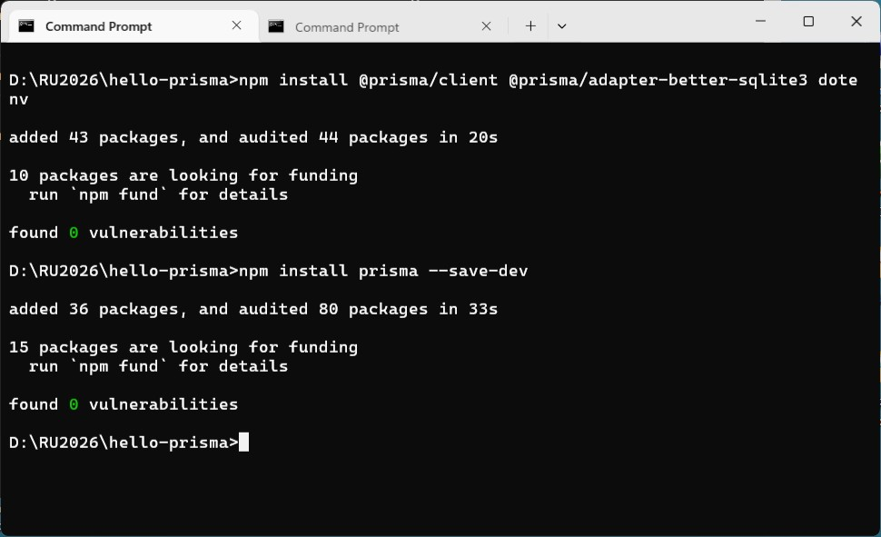
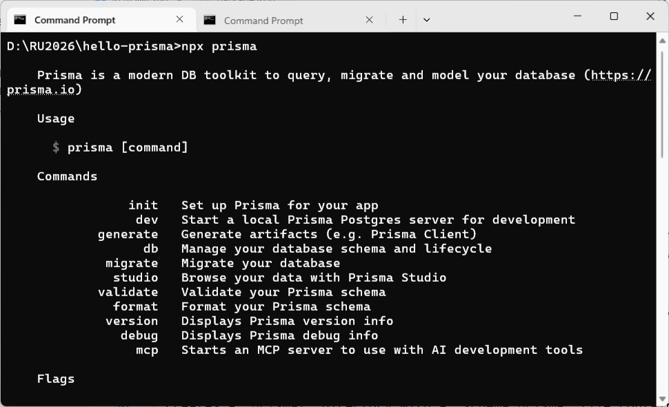
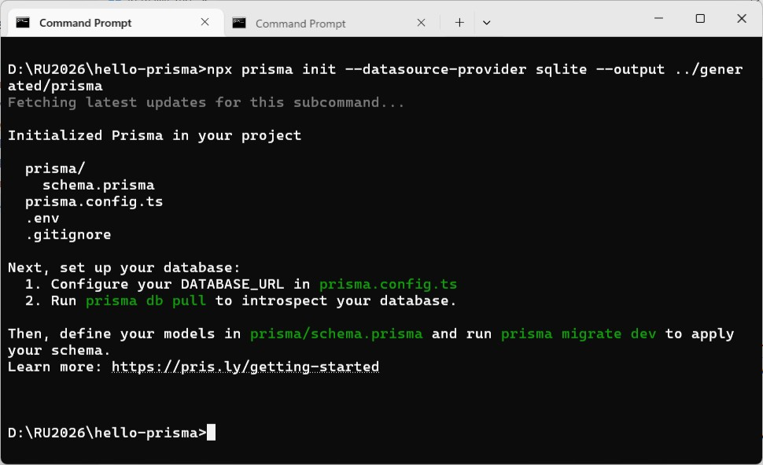
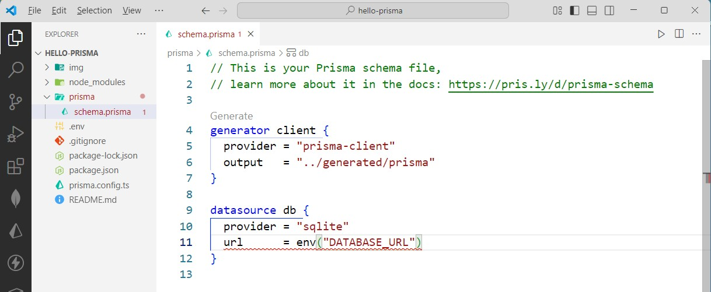
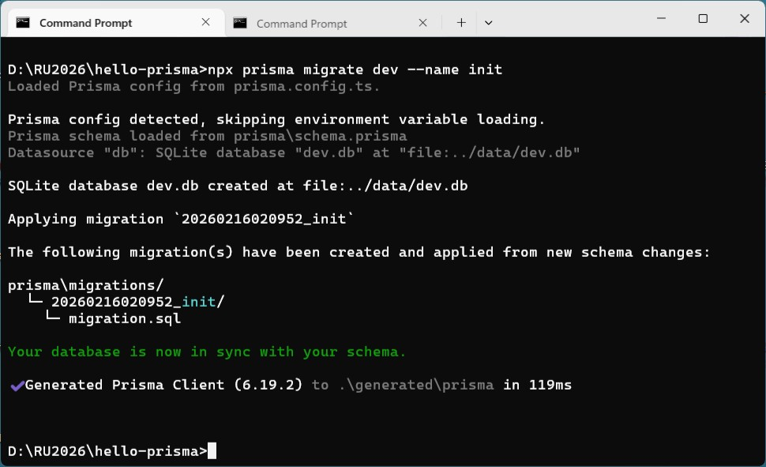
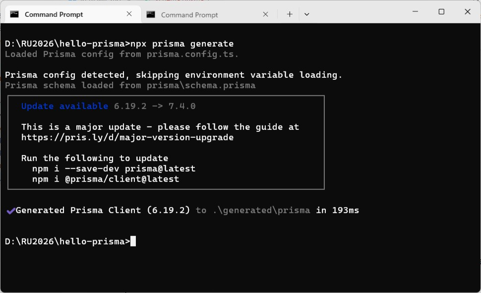
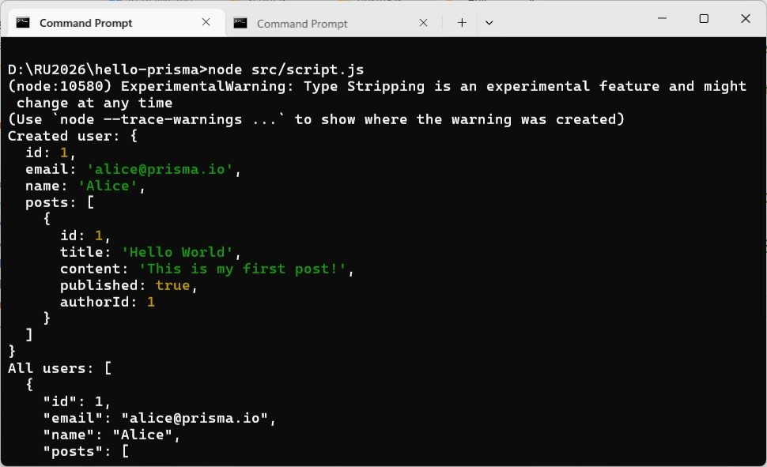
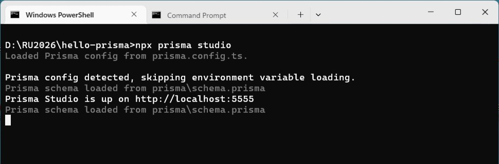
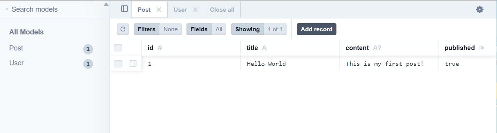

### Quickstart with Prisma ORM and SQLite for Javascript Users

[SQLite](https://sqlite.org/) is a lightweight, file-based database that's perfect for development, prototyping, and small applications. It requires no setup and stores data in a local file.

In this guide, you will learn how to set up a new TypeScript project from scratch, connect it to SQLite using Prisma ORM, and generate a Prisma Client for easy, type-safe access to your database.


#### Prerequisites
You need:

- [Node.js](https://nodejs.org/en/) v20.19+, v22.12+, or v24.0+ installed on your machine
- Basic knowledge of JavaScript


#### 1. Create a new project
Create a project directory and navigate into it:
```
mkdir hello-prisma
cd hello-prisma
```

Initialize a JavaScript project:
```
npm init -y
mkdir src 
mkdir data
mkdir img
```


#### 2. Install required dependencies
Install the packages needed for this quickstart:
```
npm install @prisma/client @prisma/adapter-better-sqlite3 dotenv
npm install prisma --save-dev 
```



Here's what each package does:
- `@prisma/client` - The Prisma Client library for querying your database
- `@prisma/adapter-better-sqlite3` - The SQLite driver adapter that connects Prisma Client to your database
- `dotenv` - Loads environment variables from your .env file
- `prisma` - The Prisma CLI for running commands like prisma init, prisma migrate, and prisma generate


#### 3. Configure ESM support
Update `package.json` to enable ESM:

package.json
```
{
  "name": "hello-prisma",
  "version": "1.0.0",
  "main": "index.js",
  "type":"module",
  "scripts": {
    "test": "echo \"Error: no test specified\" && exit 1"
  },
  "keywords": [],
  "author": "",
  "license": "ISC",
  "description": "",
  "dependencies": {
    "@prisma/adapter-better-sqlite3": "^7.4.0",
    "@prisma/client": "^6.19.2",
    "dotenv": "^17.3.1"
  },
  "devDependencies": {
    "prisma": "^6.19.2"
  }
}
```


#### 4. Initialize Prisma ORM
You can now invoke the Prisma CLI by prefixing it with `npx`:
```
npx prisma
```



Next, set up your Prisma ORM project by creating your [Prisma Schema](https://www.prisma.io/docs/orm/prisma-schema) file with the following command:
```
npx prisma init --datasource-provider sqlite --output ../generated/prisma
```



This command does a few things:

- Creates a `prisma/` directory with a `schema.prisma` file containing your database connection and schema models
- Creates a `.env` file in the root directory for environment variables

The generated schema uses [the ESM-first](https://www.prisma.io/docs/orm/prisma-schema/overview/generators#prisma-client) [prisma-client generator](https://www.prisma.io/docs/orm/prisma-schema/overview/generators#prisma-client) with a custom output path:

prisma/schema.prisma
```
generator client {
  provider = "prisma-client"
  output   = "../generated/prisma"
}

datasource db {
  provider = "sqlite"
  url      = env("DATABASE_URL")
}
```

> The datasource property `url` is no longer supported in schema files. Move connection URLs for Migrate to `prisma.config.ts` and pass either `adapter` for a direct database connection or `accelerateUrl` for Accelerate to the `PrismaClient` constructor. See https://pris.ly/d/config-datasource and https://pris.ly/d/prisma7-client-configPrisma



A `.env` file should be created with the following value:

.env
```
DATABASE_URL="file:../data/dev.db"

DATABASE_URL_RUNTIME="file:./data/dev.db"
```


#### 5. Define your data model
Open `prisma/schema.prisma` and add the following models:

prisma/schema.prisma
```
generator client {
  provider = "prisma-client"
  output   = "../generated/prisma"
}

datasource db {
  provider = "sqlite"
  url      = env("DATABASE_URL")
}

model User {
  id    Int     @id @default(autoincrement())
  email String  @unique
  name  String?
  posts Post[]
}

model Post {
  id        Int     @id @default(autoincrement())
  title     String
  content   String?
  published Boolean @default(false)
  author    User    @relation(fields: [authorId], references: [id])
  authorId  Int
}
```


#### 6. Create and apply your first migration
Create your first migration to set up the database tables:
```
npx prisma migrate dev --name init
```



This command creates the database tables based on your schema.

Now run the following command to generate the Prisma Client:
```
npx prisma generate
```




#### 7. Instantiate Prisma Client
Now that you have all the dependencies installed, you can instantiate Prisma Client. You need to pass an instance of Prisma ORM's driver adapter to the `PrismaClient` constructor:

src/lib/prisma.js
```
import "dotenv/config";
import { PrismaBetterSqlite3 } from "@prisma/adapter-better-sqlite3";
import { PrismaClient } from "../../generated/prisma/client.ts";

const connectionString = `${process.env.DATABASE_URL_RUNTIME}`;

const adapter = new PrismaBetterSqlite3({ url: connectionString });
const prisma = new PrismaClient({ adapter });

export { prisma };
```

#### 8. Write your first query
Create a `script.js` file to test your setup:

src/script.js
```
import { prisma } from './lib/prisma.js'

async function main() {
  // Create a new user with a post
  const user = await prisma.user.create({
    data: {
      name: 'Alice',
      email: 'alice@prisma.io',
      posts: {
        create: {
          title: 'Hello World',
          content: 'This is my first post!',
          published: true,
        },
      },
    },
    include: {
      posts: true,
    },
  })
  console.log('Created user:', user)

  // Fetch all users with their posts
  const allUsers = await prisma.user.findMany({
    include: {
      posts: true,
    },
  })
  console.log('All users:', JSON.stringify(allUsers, null, 2))
}

main()
  .then(async () => {
    await prisma.$disconnect()
  })
  .catch(async (e) => {
    console.error(e)
    await prisma.$disconnect()
    process.exit(1)
  })
```

Run the script:
```
node src/script.js
```



You should see the created user and all users printed to the console!


#### 9. Explore your data with Prisma Studio
Prisma Studio is a visual editor for your database. Launch it with:
```
npx prisma studio
```

This opens a web interface where you can view and edit your data.






#### 10. Project structure 
```

```

#### Next steps
You've successfully set up Prisma ORM. Here's what you can explore next:

- **Learn more about Prisma Client**: Explore the [Prisma Client API](https://www.prisma.io/docs/orm/prisma-client) for advanced querying, filtering, and relations
- **Database migrations**: Learn about [Prisma Migrate](https://www.prisma.io/docs/orm/prisma-migrate) for evolving your database schema
- **Performance optimization**: Discover [query optimization techniques](https://www.prisma.io/docs/orm/prisma-client/queries/query-optimization-performance)
- **Build a full application**: Check out our [framework guides](https://www.prisma.io/docs/guides) to integrate Prisma ORM with Next.js, Express, and more
- **Join the community**: Connect with other developers on [Discord](https://pris.ly/discord)


#### More info
- [SQLite database connector](https://www.prisma.io/docs/orm/overview/databases/sqlite)
- [Prisma Config reference](https://www.prisma.io/docs/orm/reference/prisma-config-reference)
- [Database connection management](https://www.prisma.io/docs/orm/prisma-client/setup-and-configuration/databases-connections)


#### Reference 
[Quickstart with Prisma ORM and SQLite](https://www.prisma.io/docs/getting-started/prisma-orm/quickstart/sqlite)


### EOF (2026/01/16)